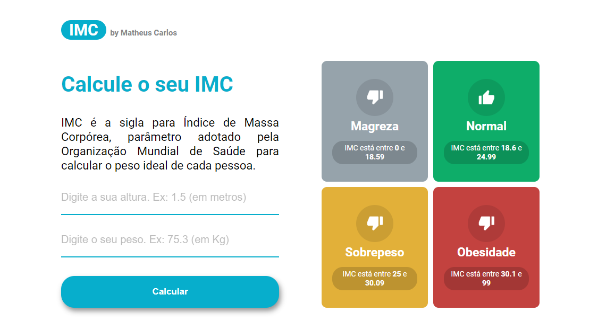

<h1 align="center"> Calculadora de IMC </h1>

  Aplicação web feita para calcular o índice massa copórea.  

  <a href="#-tecnologias">Tecnologias</a>&nbsp;&nbsp;&nbsp;|&nbsp;&nbsp;&nbsp;
  <a href="#-projeto">Projeto</a>&nbsp;&nbsp;&nbsp;|&nbsp;&nbsp;&nbsp;
  <a href="#memo-licença">Licença</a>&nbsp;&nbsp;&nbsp;|&nbsp;&nbsp;&nbsp;
  <a href="#telephone_receiver-contato">Contato</a>

 

  

## 🚀 Tecnologias

Esse projeto foi desenvolvido com as seguintes tecnologias:

-   JSX e CSS
-   React JS
-   TypeScript

## 💻 Projeto

Uma página WEB onde é possível preencher os campos com sua altura e seu peso, e a partir dessas informações a aplicação consegue retornar seu índice de massa corpórea. Com base no resultado, informa se você está no nível magreza, sobrepeso ou obesidade.

-   Confira o site [online aqui](https://marvel-comics-one-taupe.vercel.app/)

## :telephone_receiver: Contato

-   [Linkedin](https://www.linkedin.com/in/matheuscarlosf/)
-   [Instagram](https://www.instagram.com/matheuscarlosf/)
-   [E-mail](matheuscarlos16@hotmail.com)

---

## :memo: Licença

Desenvolvido por Matheus Carlos :wave:
